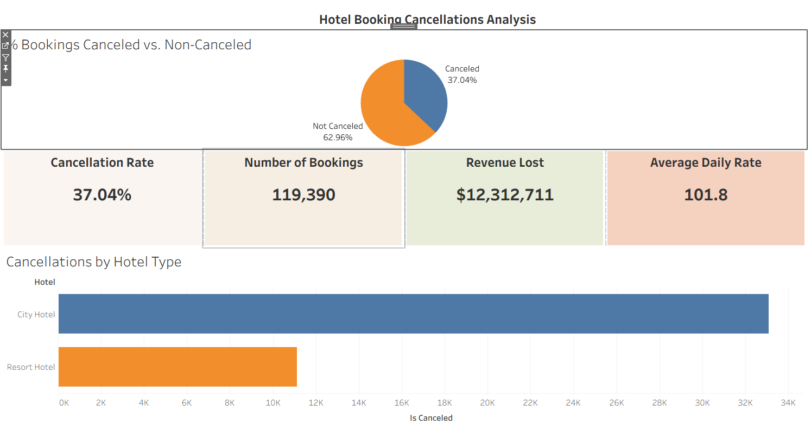
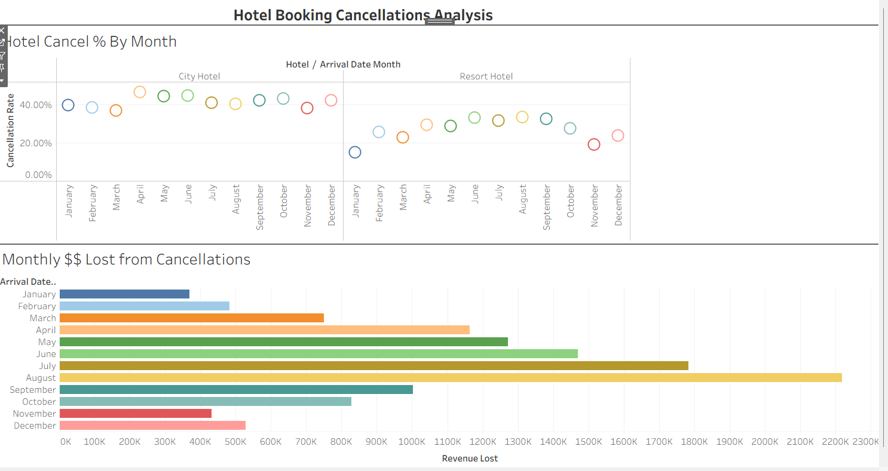

# Hotel Booking Cancellations Analysis

##  Project Overview
This project analyzes hotel booking data to uncover trends in cancellations. 
High cancellation rates affect revenue and forecasting in the hospitality industry. 
The goal is to identify factors that contribute to cancellations and provide data-driven recommendations.

**Tools Used:** SQL (MySQL Workbench), Microsoft Excel, Tableau

### Data
- **Source:** [Hotel Bookings Dataset](https://www.kaggle.com/jessemostipak/hotel-booking-demand) 
- **Size:** ~119k rows, 32 columns  
- **Key Fields Used:** `is_canceled`, `hotel`, `arrival_date_month`, `country`, `adr (average daily rate)`  

---

##  Research Questions
-Is seasonality a major cause of high cancellation rates?
-Are guests from certain countries more likely to cancel than others?
-How much revenue is lost yearly from cancelled bookings?
-What is the cancellation rate of each hotel type (city vs resort)?
-What steps should be taken to successfully decrease the cancellation rate?

---

## Hypotheses
-Higher lead times may correlate to higher cancellation rates
-There are fewer cancellations from reservations made with special guest requests
-There are, conversely, higher cancellations from reservations with frequent booking changes
-Domestic guests potentially have a higher cancellation rate than foreigners
-Summer season has a higher cancellation rate compared to the rest of the year

---

##  Methodology
- Wrote SQL queries to aggregate cancellations by channel, lead time, requests, deposits, and country.
- Calculated cancellation percentages and compared across customer segments.
- Built Tableau dashboards to visualize trends.

---

##  Key Insights
-Higher lead time has an impact on cancellation rates; average for cancelled bookings is 145 days, compared to 80 for non-cancelled
-More special requests did correlate to lower cancellation rate; however, it was found that reserations with no booking changes in fact had the highest cancellation rate, at 41%
-Domestic guests did indeed have a far higher cancellation rate, at 56% compared to just 23% for international guests
-Summer indeed has the highest cancellation rate (with June being the highest individual month) at 38%, albeit by a very narrow margin--all four seasons were within 5% of one another
-Top three individual monrhs by cancellation revenue loss were, as expected, August, July, and June, with all being well over $1 million in losses
-City Hotel had a significanrly higher cancellation rate than Resort hotel (41% vs 27%), as a result nearly doubling loss of revenue (10.8 million vs 5.8 million)

---

##  Visualizations
This project is split into two dashboards for clarity.

1. **Dashboard 1 – Cancellation Overview**
   - Overall cancellation rate (vs non-canceled bookings)  
   - Cancellation rate by hotel type  
   - KPI cards with high-level stats  

2. **Dashboard 2 – Revenue Impact**
   - Cancellation % by month (circle chart)  
   - Estimated revenue lost per month (bar chart)  

📂 Tableau Packaged Workbook: (hotel_cancellation_analysis.twbx)  
Preview:  
  

---

##  Conclusions & Recommendations
- Require deposits for long-lead reservations (>90 days).
- Promote upselling of special requests as a proxy for guest commitment.
- Heavier promotion of discounts and loyalty programs for domestic guests.

---
